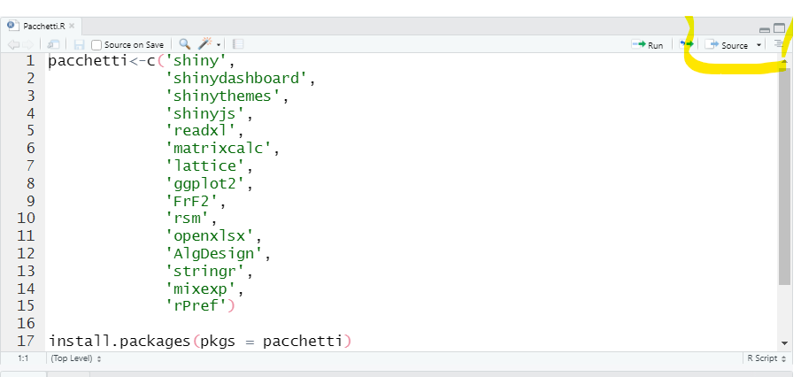

------------------------------------------------------------------------

------------------------------------------------------------------------

## Utenti **Mac**

### Installare **DoE**

Per chi ha già installato **R** e **RStudio** andare al punto 3.

1.  Scaricare ed istallare [R](https://cran.rstudio.com/ "Download and Install R")

2.  Scaricare ed installare [RStudio](https://rstudio.com/products/rstudio/download/#download "RStudio Desktop")

3.  Scaricare la cartelletta [DoE](https://drive.google.com/file/d/1g_bzvnx8kOsWzetetHqThAHC5EGQ1EEe/view?usp=sharing "DoE.zip") e dezipparla

4.  Per installare i pacchetti necessari al funzionamento dell'applicativo **DoE** aprire la cartelletta dezippata **DoE**, aprire il file **Pacchetti.R** con **RStudio** (doppio click sul file). Quindi cliccare sul tasto *Source* (ci vorrà qualche minuto).

{width="683"}

### Avviare DoE

Per avviare l'applicativo è sufficiente aprire **RStudio** (cliccando su un file *.R* come ad esempio *Pacchetti.R*) digitare

*shiny::runApp()*

nella console e quindi tasto **Enter**.

Per semplificare è possibile creare un progetto dedicato andando nel menù *File/New Project di **RStudio***. Scegliere **Existing Directory** e selezionare la cartella **DoE** in cui sono stati dezippati tutti i file.

Per avviare **DoE** basta cliccare sul file *.Rproj* che si è creato nella cartella **DoE** e proceedere come sopra. Si consiglia di creare un collegamento a tale file sul desktop.
