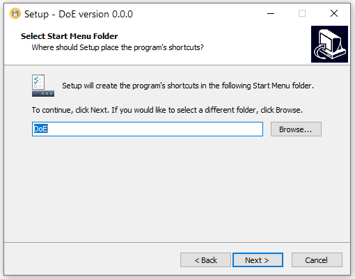

The executable application "DoE.exe" will install the open-source software R, together with all the packages necessary for running the software named "DoE" that we will use during the exercises.

## 1. Preliminary note

The executable version of the DoE.exe program is in beta version. We therefore ask you to try it and report any bugs or errors (for example, the lack of a library, etc ...) to the following addresses: [Giorgio Marrubini](mailto:giorgio.marrubini@unipv.it), [Camillo Melzi](mailto:camillomelzi@gmail.com).

Regrettably, the executable currently only works for Windows.

## 2. Download the executable

Download the file <a href="https://drive.google.com/file/d/1779uwgGjAYIz5gPzA6AIQY-6aDYx3zSu/view?usp=sharing" target="_blank">setup\_DoE.exe</a> then run the executable by mouse double-click  on the icon: 

{width="85"}

If necessary, allow installing apps by unknown author/source, then accept the "License Agreement" and click on the *Next* button. The software that we are providing for free is made in-house. No antivirus collected information on it as of today. Therefore antivirus software will warn you about the dangers of installing software from unknown sources.

{width="420"}

Click the Next button again in the window

{width="420"}

Select the directory to install the program (I recommend keeping C: \\ 
Warning !! do not use the Program Files or Program Files (x86) directories).

Click on the Next button in the next window

{width="420"}

Choose whether to create a shortcut to the application on the desktop (recommended)

{width="420"}

Then press the Install button and then Next in the subsequent windows

{width="420"}

{width="420"}

Finally, click on the Finish button (I recommend leaving the flag on Launch DoE )

{width="420"}

Once the necessary libraries have been loaded (the first time it may take some time), the application opens.

On the desktop (if you have chosen to create a shortcut to the application), there should be the shortcut icon

{width="100"}

## 3. Uninstall application

DoE can be uninstalled like any other Windows application. Alternatively, to uninstall in the DoE folder created in C: \\ (or in the directory chosen for installation), there is a unis000.exe icon. Double click on the icon and uninstallation starts. Once DoE has been unistalled, a message similar to the one reported below should appear.

