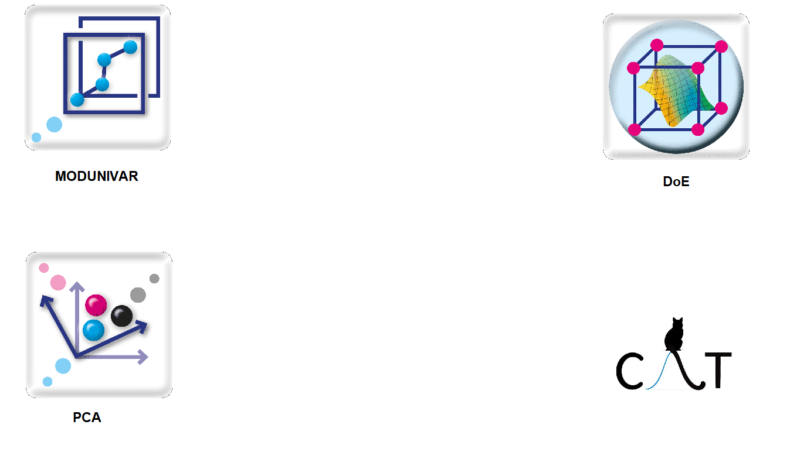

<!-- 
 -->

<!--  -->

<!-- 
 -->

<!-- <html> -->

<!-- <body> -->

<!--  -->

<!-- <map name="immagine"> -->

<!--   <area shape="rect" coords="0,0,180,180" alt="Modunivar" href="https://istrsetup.netlify.app/modunivar_ita.html"> -->

<!--   <area shape="rect" coords="630,0,850,180" alt="DoE" href="https://istrsetup.netlify.app/doe_ita.html"> -->

<!-- </map> -->

<!-- </body> -->

<!-- </html> -->

[{width=20%}](https://istrsetup.netlify.app/modunivar_ita.html)
[{width=20%}](https://istrsetup.netlify.app/doe_ita.html)

              

      
         
[{width=20%}](https://istrsetup.netlify.app/pca_ita.html)
[{width=20%}](http://gruppochemiometria.it/index.php/software)
