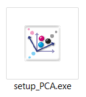
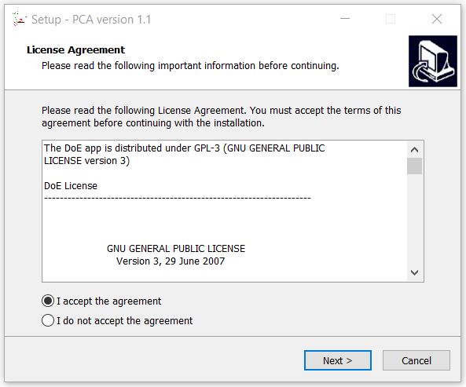
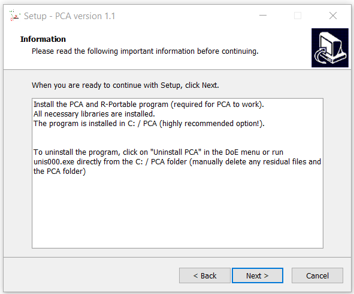
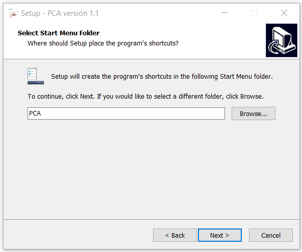
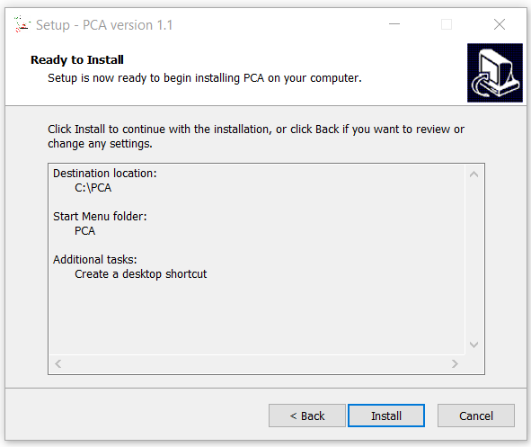
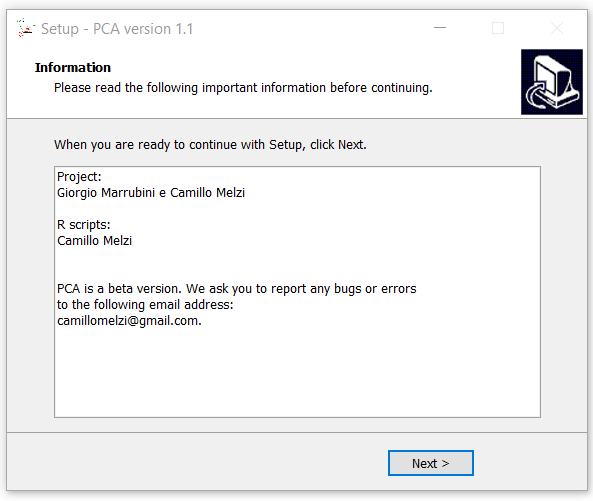
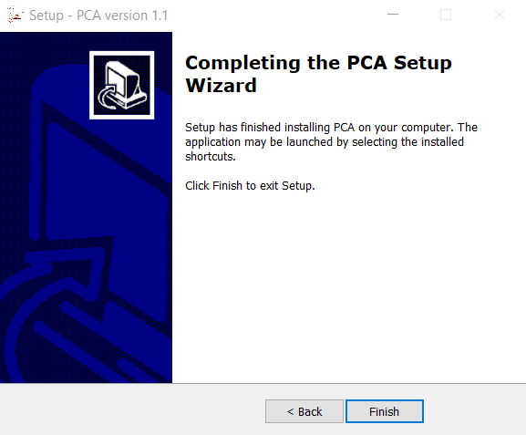
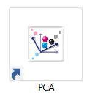
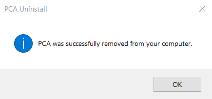

L'applicazione eseguibile "PCA.exe" installerà il software open-source R, insieme a tutti i pacchetti necessari per l'esecuzione del software denominato "PCA" che utilizzeremo durante gli esercizi.

## 1. Nota preliminare

La versione eseguibile del programma PCA.exe è in versione beta. Vi preghiamo quindi di provarlo e di segnalare eventuali bug o errori (ad esempio, mancanza di libreria, ecc...) ai seguenti indirizzi: [Giorgio Marrubini](mailto:giorgio.marrubini@unipv.it), [Camillo Melzi](mailto:camillonelzin@gmail.com).

Purtroppo, l'eseguibile attualmente funziona solo per Windows.

## 2. Scaricare l'eseguibile

Scaricare il file [setup\_PCA.exe](https://drive.google.com/open?id=1IEVIbt_LWVE6Ry-XRDBGt_r6FbVQbAZJ&authuser=camillomelzi%40gmail.com&usp=drive_fs) ed avviare l'eseguibile con doppio click sull'icona

{width="85"}

Se necessario, consentire l'installazione di app di autore / fonte sconosciuti, quindi accettare il "Contratto di licenza" e fare clic sul pulsante *Avanti* . Il software che forniamo gratuitamente è realizzato internamente. Nessun antivirus ha raccolto informazioni su di esso fino ad oggi. Pertanto il software antivirus ti avviserà dei pericoli derivanti dall'installazione di software da fonti sconosciute.

{width="420"}

Fare di nuovo clic sul pulsante Avanti nella finestra

{width="420"}

Seleziona la directory in cui installare il programma (consiglio di mantenere C: \\ Attenzione!! non utilizzare le directory Program Files o Program Files (x86)).

Fare clic sul pulsante Avanti nella finestra successiva

{width="420"}

Scegli se creare un collegamento all'applicazione sul desktop (consigliato)

{width="420"}

Quindi premere il pulsante Installa e poi Avanti nelle finestre successive

{width="420"}

{width="420"}

Infine, fai clic sul pulsante Fine (consiglio di lasciare flag su Launch PCA)

\

{width="420"}

Dopo che le librerie necessarie sono state caricate (la prima volta potrebbe richiedere del tempo), l'applicazione si apre.

Sul desktop (se hai scelto di creare un collegamento all'applicazione), dovrebbero esserci l' icone di collegamento

{width="100"}

## 3. Disinstallare l'applicazione

PCA può essere disinstallato come qualsiasi altra applicazione Windows. In alternativa, per eseguire la disinstallazione nella cartella PCA creata in C: \\ (o nella directory scelta per l'installazione), è presente un'icona unis000.exe. Fare doppio clic sull'icona e verrà avviata la disinstallazione. Una volta che PCA è stato disistallato, dovrebbe apparire un messaggio simile a quello riportato di seguito.

